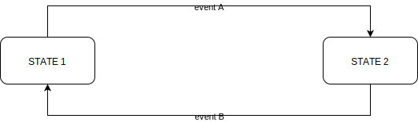
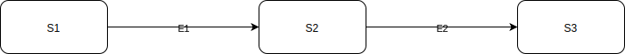
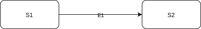
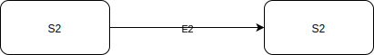
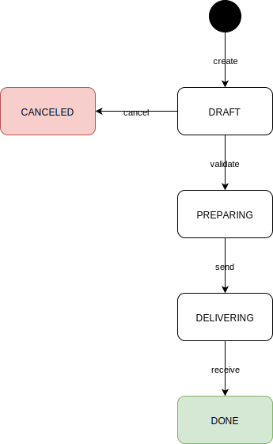

Short description
===================

[Wikipedia - UML state machine](https://en.wikipedia.org/wiki/UML_state_machine)

>UML state machine, also known as UML statechart, is a significantly enhanced realization of the mathematical concept of a finite automaton in computer science applications as expressed in the Unified Modeling Language (UML) notation.
> 
>The concepts behind it are about organizing the way a device, computer program, or other (often technical) process works such that an entity or each of its sub-entities is always in exactly one of a number of possible states and where there are well-defined conditional transitions between these states.

[Spring Statemachine - Projects](https://projects.spring.io/spring-statemachine)

[Spring statemachine - Reference Documentation](https://docs.spring.io/spring-statemachine/docs/current/reference/htmlsingle)

Simply put, a state machine allows to manage the **transition** between a **state** Sn to an other **state** Sn+1, or between the **states** from Sn to Sn-1, with the use of **events**. 

With a state machine you declare which states is expected depending oh the event used :

Then if we have this examples :
* let an entity at the state _S1_, if we use the event _E1_ then the transition will be **accepted** and the entity will have his state **changed** to _S2_\

* let an entity at the state _S1_, if we use the event _E2_ then the transition will be **refused** and the entity will **stay** at its state _S1_\

* let an entity at the state _S2_, if we use the event _E2_ then the transition will be **accepted** and the entity will have its state **changed** to _S3_\

* let an entity at the state _S2_, if we use the event _E1_ then the transition will be **refused** and the entity will **stay** at its state _S2_\

Use cases used for the demonstration
==============

We will use a very simple model for the state-machine : an amazon order as everyone know it and can this way understand it\
 /!\ **it's a false workflow, create just for the demonstration** /!\

1. [basic](https://github.com/FrogDevelopment/state-machine-demo/tree/0_simple_use_case)\

2. [usning action](https://github.com/FrogDevelopment/state-machine-demo/tree/1_action_use_case)\

3. [using guard](https://github.com/FrogDevelopment/state-machine-demo/tree/2_guard_use_case)\

4. [using choice](https://github.com/FrogDevelopment/state-machine-demo/tree/3_choice_use_case)\

5. [having interactions](https://github.com/FrogDevelopment/state-machine-demo/tree/4_interaction_use_case)\

