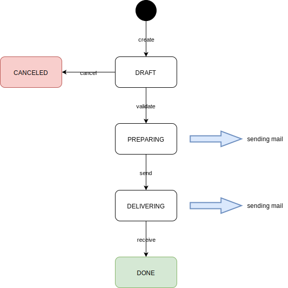

Short description
===================

[Spring Statemachine - Projects](https://projects.spring.io/spring-statemachine/)

[Spring statemachine - Reference Documentation](https://docs.spring.io/spring-statemachine/docs/current/reference/htmlsingle/)

Examples used
==============

Here is a very simple example of state-machine.

Use of a very common use case : an amazon order => everyone know it \o/ \
 /!\ **it's a false workflow, create just for the demonstration** /!\

1. [simple](https://github.com/FrogDevelopment/state-machine-demo/tree/0_simple_use_case)\

2. [action](https://github.com/FrogDevelopment/state-machine-demo/tree/1_action_use_case)\

3. [guard](https://github.com/FrogDevelopment/state-machine-demo/tree/2_guard_use_case)\

4. [choice](https://github.com/FrogDevelopment/state-machine-demo/tree/3_choice_use_case)\

5. [interactions](https://github.com/FrogDevelopment/state-machine-demo/tree/4_interaction_use_case)\

 
 <a href="https://github.com/FrogDevelopment/state-machine-demo/tree/0_simple_use_case">Branche 0_simple_use_case</a>

 </image>
  
 
 <a href="https://github.com/FrogDevelopment/state-machine-demo/tree/1_action_use_case">Branche 1_action_use_case</a>
  
 </image>
  
 
  <a href="https://github.com/FrogDevelopment/state-machine-demo/tree/2_guard_use_case">Branche 2_guard_use_case</a>
  
 </image>
  
 
  <a href="https://github.com/FrogDevelopment/state-machine-demo/tree/3_choice_use_case">Branche 3_choice_use_case</a>
  
 </image>
  
 
  <a href="https://github.com/FrogDevelopment/state-machine-demo/tree/4_interaction_use_case">Branche 4_interaction_use_case</a>
  
 </image>
  
